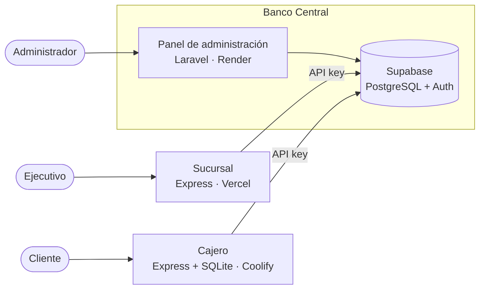

# Sucursal

Servidor de sucursal del sistema bancario distribuido (Examen 2, Tópicos de Desarrollo Web).
Lo usan los ejecutivos para abrir cuentas, consultar el historial de la sucursal o de un
cliente y ver un reporte de operaciones. Todo se guarda en el Banco Central (Supabase); la
sucursal se conecta con su API key.

Desplegado en Vercel: https://banco-sucursal.vercel.app

## Arquitectura



| Nodo | Repositorio | Despliegue |
|---|---|---|
| Banco Central | [banco-central](https://github.com/slashgarciaitc/banco-central) | Panel en Render: pendiente |
| Sucursal | [banco-sucursal](https://github.com/slashgarciaitc/banco-sucursal) | https://banco-sucursal.vercel.app |
| Cajero | [banco-cajero](https://github.com/slashgarciaitc/banco-cajero) | Coolify (VM local): http://cajero.192.168.139.102.sslip.io |

## Endpoints

Los ejecutivos inician sesión con Supabase Auth. Todas las rutas, menos `/api/login`, piden
el token en `Authorization: Bearer`. El detalle está en [openapi.yaml](openapi.yaml).

| Método | Ruta | Descripción |
|---|---|---|
| POST | `/api/login` | Iniciar sesión |
| GET | `/api/sucursal` | Datos de la sucursal |
| POST | `/api/cuentas` | Abrir una cuenta |
| GET | `/api/cuentas/:cuenta` | Consultar una cuenta |
| GET | `/api/historial` | Operaciones hechas en la sucursal |
| GET | `/api/historial/:cuenta` | Movimientos de un cliente |
| GET | `/api/reporte` | Reporte de operaciones |

## Estructura

```
sucursal/
├── public/            interfaz web
├── src/
│   ├── middlewares/   login requerido, errores, logger
│   ├── routes/
│   ├── services/      llamadas al Banco Central y a Supabase Auth
│   ├── app.js
│   └── server.js
└── openapi.yaml
```

## Correr en local

```bash
npm install
cp .env.example .env    # URL y llave pública de Supabase, y la API key de la sucursal
npm run dev             # http://localhost:3001
```

La API key de la sucursal la genera el Banco Central. Para el login se necesita un usuario
de Supabase Auth (en `banco-central`: `npm run usuario -- correo contraseña`).

En Vercel se configuran las mismas variables del `.env` en Environment Variables. Cada push
a `main` vuelve a desplegar.
